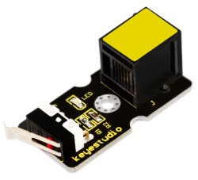
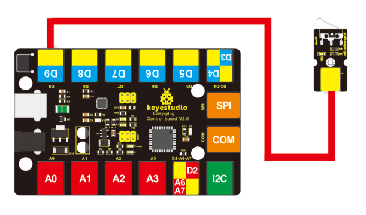
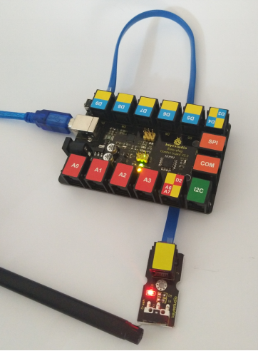

# KS0111 keyestudio EASY plug Collision Sensor



## 1. Introduction

Crash sensor, also known as snap-action switch, is an electric switch that is actuated by very little physical force.

It is a digital on-off input module necessary for elementary electronic. By programming, it can be used for the light, sound device, key function of LCD display, 3D Printer position feedback, or other devices.

This sensor needs to be used together with EASY plug control board.

**Special Note:**

The sensor/module is equipped with the RJ11 6P6C interface, compatible with our keyestudio EASY plug Control Board with RJ11 6P6C interface.

If you have the control board of other brands, it is also equipped with the RJ11 6P6C interface but has different internal line sequence, can’t be used compatibly with our sensor/module.

## 2. Specification

- Connector: Easy plug
- Onboard status indicator LED
- M3 mounting hole, convenient for fixation on other devices.
- If collision happened, outputs LOW level signal; no collision, outputs HIGH level signal.

## 3. Technical Details

- Dimensions: 44mm * 20mm * 18mm
- Weight: 5.5g

## 4. Connect It Up

Connect the EASY Plug Crash sensor and LED module to control board using RJ11 cable.



## 5. Upload the Code

Download code:  [Code](./Code.7z)

```c
int Led=13;// set pin for LED
int Shock=9// set pin for collision sensor;
int val;// set digital variable val
	
void setup()
{
    pinMode(Led,OUTPUT);// set pin LED as output
    pinMode(Shock,INPUT);// set collision sensor as input
}

void loop()
{
    val=digitalRead(Shock);// read value on pin 9 and assign it to val
    if(val==HIGH)// when collision sensor detects a signal, turn LED on.
    {
    	digitalWrite(Led,LOW);
    } 
    else
    {
    	digitalWrite(Led,HIGH);
    }
}
```

## 6. Result

When an object crashes the metal switch of the sensor, the indicator LED is turned on. If no crash happened, LED is turned off.

